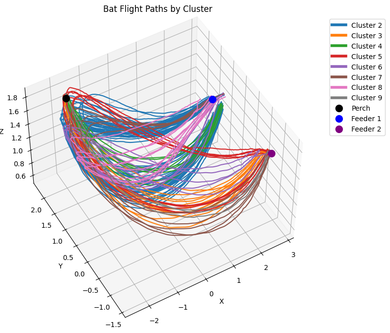

# batTIMBRE
Welcome to the batTIMBRE project! This repository is dedicated to applying the [TIMBRE architecture (developed by Professor Gautam Agarwal)](https://github.com/beatLaboratory/TIMBRE) to neuropixel probe data on bats. The primary goal of this project is to verify whether Local Field Potential (LFP) recordings encode positional information in bats. By analyzing both positional and neural data, we aim to gain insights into the neural underpinnings of bat navigation and spatial awareness.

### Bat flight paths!


## Files of note
- `bat_TIMBRE.ipynb` is where all the most important operations are done. From preprocessing to the final execution of TIMBRE on the bat data, it's all here and (to some extent) explained step by step.
- `dataset.py` is the code provided by the Yartsev lab for easily accessing their flight data. The example notebook (next bulletpoint) shows how to work with these.
- `example.ipynb` is an example notebook of how we can access the bat data and different graphs displaying the nature of the flight paths. It explains that the flight paths are separated by cluster, how the flight paths look in 3D space, and shows cluster position over time. Thank you Kevin Qi!
- `helpers.py` contains all the helper methods developed for analyses on the bat data.

# Goals with this project
- Our end goal is training TIMBRE on the bats' LFP (local field potential) and flight path data to see if LFP encodes position, as there is a precedent with carrier-free decoding in rats (see [References](#references)).
- Currently, we are focusing on whether LFP can encode the destination of the bats' flight paths. In other words: *once trained, will TIMBRE accurately predict if a bat will arrive at either of the two feeders or the perch?*
- If we get good results with this analysis, we will move on to broader, more intensive investigation.


# Getting started
First, clone the repository. Next, you will need to create a virtual environment to handle all the dependencies. 
### Creating development (virtual) environment

We need to create a virtual environment (venv) to handle the odd dependencies of this project. Since we're trying to get two different projects to talk to eachother nicely, this is easily solved with a venv:

```bash
python -m venv venv
```

### To activate the environment:

Windows:
```bash
venv\Scripts\activate
```
macOS/Linux:
```bash
source venv/bin/activate
```
Install dependencies using ```setuptools```
```bash
pip install -e .
```

Doing it this way ensures that we can easily establish imports between folders and files using the toplevel structure.

## References
- Agarwal, B Lustig, S Akera, E Pastalkova, AK Lee, FT Sommer. [News without the buzz: reading out weak theta rhythms in the hippocampus.](https://www.biorxiv.org/content/10.1101/2023.12.22.573160v1) bioRxiv, 2023.12. 22.573160